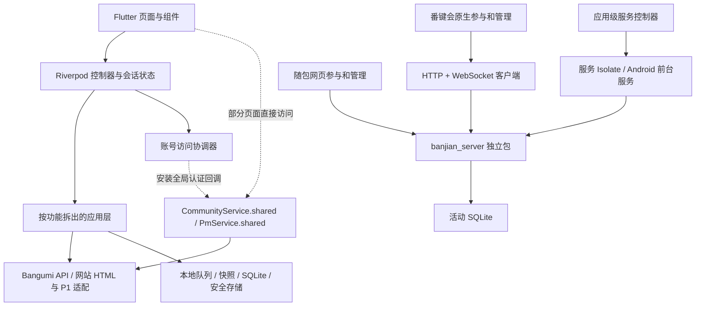

# MuBangumi 软件架构审查

审查日期：2026-09-19。代码基线：`v2.3.0+28`，提交 `3d345e8`。

## 结论

主应用处于从水平分层向按功能组织逐步迁移的阶段，适合沿现有 Flutter + Riverpod 架构继续演进。收藏编辑、凭据管理、同步调度和详情加载已经有可独立验证的模块；番键会服务端也已独立成包。

当前最需要处理的是**异步状态一致性、依赖归属，以及缓存和实时数据的边界**。本次确认了一类可复现的运行缺陷：番键会参与端的迟到 HTTP 成功/失败会覆盖较新的状态。其余发现主要属于可维护性和容量风险，应与已复现缺陷区分。

本次没有修改业务代码、修改真实账号数据或发布新版本。新增内容仅为本报告和审查证据。

## 范围与方法

- 静态扫描 `lib/` 全部 Dart 文件的 import/export，统计层级、引用和强连通分量。
- 手工走读启动、身份协调、收藏加载/编辑、私信队列、备份、番键会客户端与服务端的关键路径。
- 针对番键会刷新顺序构造两个可控制响应先后的隔离测试，使用临时数据库与本机随机端口。
- 沿用本版本已有发布验证作为基线：1131 项 Flutter 测试、24 项后端测试及云端 CI 通过。本轮没有重复全量测试；新增的两个审查场景均复现缺陷，说明现有测试仍有覆盖空白。
- 网站、冻结的 Kotlin 原型及 Python 推荐/检索项目只核对定位和依赖关系，不声称完成其内部代码审计；未做真机、长时负载或渗透测试。

## 当前结构



主应用的 Bangumi OAuth、网站 Cookie、番键会成员/管理凭证是不同认证域。统一登录体验的协调器已经存在，应继续明确各自所有者和有效期，避免把它们当作同一种凭据。

`packages/banjian_server` 同时被 Flutter 以本地依赖嵌入，并可编译为独立服务程序，**不属于与 Flutter 完全无依赖的卫星模块**。`native-android` 是冻结原型，当前正式 Android APK 来自 Flutter；两套实现不应混作一套维护中的客户端。

### 代码规模与依赖事实

物理行数包含注释和空行，只用于定位检查范围，不等同于代码质量或运行性能。

| 区域 | Dart 文件数 | 物理行数 |
|---|---:|---:|
| core | 61 | 15,647 |
| features | 42 | 12,122 |
| models | 15 | 2,836 |
| screens | 41 | 20,150 |
| state | 27 | 5,842 |
| widgets | 49 | 14,806 |
| main / app | 2 | 128 |
| 合计 | 237 | 71,531 |

- `features/*/application/` 未发现反向导入 `state/`、`screens/`、`widgets/`，说明已有拆分形成了实际边界。
- 47 个源文件引用 `session_controller.dart`。其中包含兼容性重导出带来的引用，不能据此推断这些页面都会在每次状态更新时重建。
- 找到 3 组循环依赖，分别涉及 13、5、2 个文件。Dart 允许这些循环，它们主要影响职责边界和独立复用，不是运行崩溃的证明。
- 较大的文件包括：`community_service.dart` 1965 行、`community_widgets.dart` 1738 行、`discover_page.dart` 1442 行、`collection_stats_page.dart` 1393 行。拆分应围绕职责，而不是单纯追求文件变短。

原始统计：[dependency-inventory.json](review-2026-09-19/dependency-inventory.json)。

## 发现与优先级

### F1 · P1 · 番键会参与端缺少请求级的迟到结果保护【已复现】

位置：[room_connection.dart](../../lib/features/anime_appreciation/room_connection.dart#L284)。

`refresh()` 只检查 `_generation`，该值用于参与身份/生命周期失效；同一身份下的多次刷新拥有相同值。成功分支直接 `event = data`，失败分支直接 `online = false`。`restore()` 又会主动启动不等待完成的刷新，手动刷新、重连和 WebSocket 更新可能与之交错。

复现结果：

1. 请求 A 先开始并持有旧快照；请求 B 后开始并成功取得新活动标题；再放行 A，标题从“较新的活动状态”回退为“原生参与测试”。
2. 请求 B 已经成功恢复连接；再让旧请求 A 失败，`online` 被改回 `false`。

影响是页面回退、连接状态错误，以及后续队列调度被干扰。服务端原轮次校验和幂等收据仍在，不应把这次发现扩大解释为已经发生串投或重复记分。

同一链路还有一个应一并覆盖的边界：`disconnected()` 没有核对触发回调的 WebSocket 是否仍是当前 `_socket`。本轮没有单独复现旧 socket 回调覆盖新连接，暂作为待补测试场景。

建议：

- 给每次刷新独立的请求序号，或明确定义同一请求的合并策略；旧请求成功和失败都不能发布状态。
- WebSocket 回调核对当前连接实例和参与身份。
- HTTP 与 WebSocket 共同采用可比较的快照序号。服务端现有 `version` 用于管理操作冲突控制，评分变化并不递增，不能直接把它当成完整快照序号；应保留管理版本语义。

验收：乱序成功、乱序失败、旧 socket 关闭、新轮次推送与旧 HTTP 返回交错、切换身份五类场景均不会回退状态。

证据：[复现日志](review-2026-09-19/participant-race-repro.txt)。从项目根目录运行 [生成脚本](review-2026-09-19/reproduce_participant_race.py)，再执行：

```powershell
python docs/architecture/review-2026-09-19/reproduce_participant_race.py
flutter test .dart_tool/architecture_race_repro_test.dart --plain-name 'architecture audit:' --no-pub
```

在当前基线上预期出现两项失败，这是缺陷复现，不是发布流水线原有用例失败。

### F2 · P2 · 账号相关服务仍是全局可变实例【代码确认，未证明发生账号混用】

位置：[account_access_controller.dart](../../lib/state/account_access_controller.dart#L24)、[community_service.dart](../../lib/core/network/community_service.dart#L76)、[session_controller.dart](../../lib/state/session_controller.dart#L77)。

Riverpod Provider 创建账号协调器，但通过赋值修改 `CommunityService.shared` 和 `PmService.shared` 的认证回调；会话控制器也直接修改全局社区服务的 Token 和身份。部分页面直接使用这些单例，绕过 Provider 注入。

这使对象的实际生命周期不完全由 ProviderScope 控制。独立页面测试、多个作用域或未来多窗口会共享同一份可变认证状态，新增业务也容易依赖初始化顺序。现有身份修订号和销毁时的回调一致性检查是有效防护，应保留；本次没有证明跨账号数据泄漏。

建议：在应用装配入口创建按账号作用域持有的服务；页面读取明确的 Provider；认证信息通过注入的只读账号访问接口获得。优先拆开社区服务中的身份/传输、缓存、各类业务操作，不一次性重写全部 HTML/P1 解析。

### F3 · P2 · 导航与存储接口存在真实的依赖环【静态扫描确认】

- 导航环涉及条目详情、人物、角色、用户、小组、日志等 13 个页面/辅助文件，页面相互创建 `MaterialPageRoute`。例：[subject_detail_screen.dart](../../lib/screens/subject_detail_screen.dart#L32)、[community_target_navigation.dart](../../lib/screens/community_target_navigation.dart#L3)。
- 根组件环涉及 `app.dart`、登录准备、登录、主壳和导航布局等 5 个文件，`BrandMark` 放在 `app.dart` 是反向引用的一个入口。例：[app_navigation_layout.dart](../../lib/widgets/app_navigation_layout.dart#L2)。
- [pm_outbox_repository.dart](../../lib/core/storage/pm_outbox_repository.dart#L2) 为使用 `PmDraft` 引入具体存储文件，而 [pm_draft_store.dart](../../lib/core/storage/pm_draft_store.dart#L10) 又导入该接口。

建议先做低风险解耦：把品牌组件放进独立组件文件；把草稿模型与仓储接口移出 SQLite 实现文件；跨功能跳转改用目标描述或导航接口，在主应用统一装配页面。继续使用当前 Riverpod 即可，不必为解决这些环而先引入另一套状态框架。

验收应增加自动依赖规则，阻止新增应用层→页面依赖、基础模型→存储实现依赖和新增循环，而不只依赖普通 lint。

### F4 · P2 · 收藏快照缺少“是否完整”的数据语义【代码确认】

位置：[snapshot_cache.dart](../../lib/core/storage/snapshot_cache.dart#L89)、[session_state.dart](../../lib/state/session_state.dart#L51)。

收藏快照写入最多保留 4000 条，持久化字段只有时间和条目，没有原始总数、覆盖范围或 `truncated/isComplete` 标记。读取后仍以普通收藏列表进入会话；`isUsingCachedCollections` 只说明来源，不能说明完整性。

因此，收藏超过 4000 条时，离线恢复后的统计与筛选只能处理截断子集；当前界面虽然说明正在使用本机快照，却无法明确告知还缺多少记录。这是缓存契约的缺口，不是服务器收藏被删除。

建议：快照携带 `savedAt / sourceTotal / loadedCount / completeness / loadedTypes` 等必要元数据；统计和导出继承同一数据范围。长期可按条目存储收藏缓存，分页读取；缓存预算仍可保留，但不能静默丢失完整性信息。

### F5 · P2 · 番键会的数据存储与广播成本会随整场记录增长【结构确认，规模影响未完整实测】

位置：[store.dart](../../packages/banjian_server/lib/src/store.dart#L14)、[server.dart](../../packages/banjian_server/lib/src/server.dart#L497)、[room_connection.dart](../../lib/features/anime_appreciation/room_connection.dart#L83)。

服务端把一整场活动保存为一个 JSON 字段。每次写入重新保存整场数据，再为每个连接构建并编码完整、按权限过滤的活动快照。客户端又把凭据、草稿、待提交命令、快照和历史参与身份一起保存到安全存储；切换房间时会保留旧记录，未见总大小或历史数量上限。

目前的隔离方式是正确的：服务器在独立 Isolate 中运行，SQLite 提交后才确认，避免把同步数据库工作直接放进 UI。问题在于工作量随活动规模增长：每次小修改都涉及大对象，广播还乘以连接数，客户端草稿修改也会复制/编码整个保存对象。

容量契约也不一致：服务端允许最多 100 轮、每轮 5000 条评论；原生 HTTP 读取却在字符串长度超过 `8 × 1024 × 1024` 时拒绝响应。这里实际按字符串长度判断，不是严格的网络字节数。服务端允许的数据组合可能大于原生端可读取范围。

建议按需求逐步处理：

1. 安全存储保留凭据；草稿/命令进入事务型存储；快照和历史记录使用有预算的缓存。
2. 定义客户端、服务端一致的快照预算；评论和历史轮次分页，广播当前轮摘要或增量，并保留完整重同步入口。
3. 在使用量需要时，将成员、评分、评论、命令收据拆为独立记录，避免每次改写整场 JSON；收据清理必须保留明确的幂等重试窗口。

不能据此声称当前小型活动已经超出性能上限。已有 50 客户端约两分钟回环验证，但还不是两小时真实局域网、移动端锁屏及大评论量验证。

### F6 · P2 · 番键会内部业务状态主要依赖动态 JSON【代码确认】

后端、原生客户端和网页之间大量使用 `Map<String,dynamic>` 及字符串状态。已有 `protocol: 1` 握手核对，**不是完全没有版本检查**；但字段存在性、状态组合和错误分类仍分散在读取代码中，WebSocket 解码异常有直接忽略的路径。

建议先引入类型化的 `RoomSnapshot / RoundSnapshot / RoomCommand` 与解析边界，将异常数据变成明确可恢复错误；保留网页端共享的协议样例或 schema 验证。未来增加评分维度或远程服务能力时，用兼容字段和能力协商推进，避免客户端、网页和服务端分别猜测协议。

## 应保留的已有设计

1. **持久化后再确认。** 私信入队与清理对应草稿处于同一事务，发送中的不确定结果不会盲目重发；番键会使用操作 ID 和服务端收据处理重试。
2. **按操作语义区分队列。** 收藏/进度属于目标状态写入，私信属于追加消息，番键会命令由自有协议保证幂等。读取保持并行，并对旧结果失效。这些操作不适合被硬塞进一个串行队列。
3. **账号与修订号保护。** 收藏加载、编辑和凭据更新已经较系统地使用账号批次、修订号与串行写入屏障。应把这些成熟模式推广到新功能，而不是另起一套。
4. **多库备份有协调。** 备份仓储等待本地写入，并通过持久协调库、ATTACH 与日志模式约束保护跨库操作。数据库数量本身不是本次主要问题，不建议仅为减少文件数量而强行合库。
5. **发布检查形成了闭环。** 当前 CI 覆盖主应用、独立后端、打包与私密文件检查；发布前还能核对 Android 签名和附件校验值。测试通过提供基线，但新增并发场景仍然必要。

## 建议实施顺序

| 阶段 | 目标 | 完成标志 |
|---|---|---|
| 先处理 | F1 请求/连接状态一致性 | 本次两个复现转为通过，并覆盖 HTTP/WS 交错与账号/房间切换 |
| 第二步 | F2/F3 依赖所有权和边界 | 服务可按作用域注入；品牌/草稿模型解环；依赖规则进入 CI |
| 第三步 | F4/F6 数据契约 | 快照能说明完整性；房间消息有类型化解析与兼容样例 |
| 按容量目标推进 | F5 存储与广播 | 50 客户端长时压测、响应体预算、恢复延迟与主线程耗时有可重复数据 |

后续页面拆分优先选择 `DiscoverPage` 的查询状态与持久偏好、社区网络适配、番键会协议/状态机。`collection_stats_page.dart` 等大文件中的展示组件可以逐步抽取，但它们的行数不应排在已复现的一致性缺陷之前。

另建议补齐不记录 Token、Cookie、私信正文的结构化诊断：请求序号、连接代次、队列操作 ID、状态转换、耗时和错误类别。这样能在不依赖截图描述的情况下区分“输入卡顿、网络等待、持久化失败和迟到响应”。

## 文档维护

README 的项目结构目前没有列出 `packages/banjian_server` 和 `features/anime_appreciation`，部分历史架构文档描述的是迁移中间状态。建议以一张当前模块依赖图和本次审查基线为入口，保留旧文档作为阶段记录。
